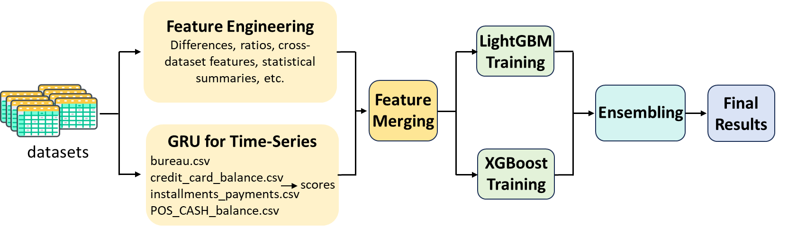

# MATH5470_Han_Liu_Liu_Chu Project 1: Home Credit Default Risk

**Team Members:**  
HAN Shi, LIU Fengming, LIU Hailin, CHU He

---

## Project Overview

This project tackles the **Home Credit Default Risk** prediction problem. Our workflow includes data preprocessing, feature engineering, model training with LightGBM and XGBoost, and ensemble modeling.

All code is written in **Jupyter Notebooks**, and you can run it **cell by cell** to reproduce our results.

---

## Our Workflow Overview


---
## File Structure

### 1. Codes

- `code_1_data_preprocessing_feature_engineering.ipynb`  
  Perform data cleaning, handle missing values, conduct feature engineering, and calculate GRU scores.

- `code_2_LGBM.ipynb`  
  Train LightGBM models on the prepared dataset, including hyperparameter tuning and cross-validation.

- `code_2_XGB.ipynb`  
  Train XGBoost models on the prepared dataset using a workflow similar to LightGBM.

- `code_3_Ensemble.ipynb`  
  Combine predictions from LGBM and XGB models using ensemble techniques.

- `bbal_gru_score.ipynb`  
  Generate GRU scores for the bureau balance table.

- `cc_gru_score.ipynb`  
  Generate GRU scores for the credit card balance table.

- `inst_gru_score.ipynb`  
  Generate GRU scores for the installments payments table.

- `pos_gru_score.ipynb`  
  Generate GRU scores for the POS-CASH balance table.


### 2.Data

- `raw/`  
  Original data downloaded from the Kaggle competition. Includes all CSV files provided by the competition.

- `prepared/`  
  Preprocessed data and calculated GRU scores ready for modeling.

### 3.Output

- `output/`  
  Figures and visualizations generated during analysis, such as feature importance plots.

### 4.Submission

- `submission/`  
  CSV file of our final submission to Kaggle.

---

## Kaggle Submission Results

**AUROC Scores**:

- **Public Leaderboard**: 0.79709  
- **Private Leaderboard**: 0.79588

---

## How to Use

1. Install the required packages by running:
   ```bash
   pip install -r requirements.txt
2. Open each Jupyter Notebook and run the cells sequentially.  
3. Make sure the `data/raw` and `data/prepared` folders are correctly placed.  
4. After running all notebooks, the final predictions and figures will be generated in the `submission` and `output` folders.

